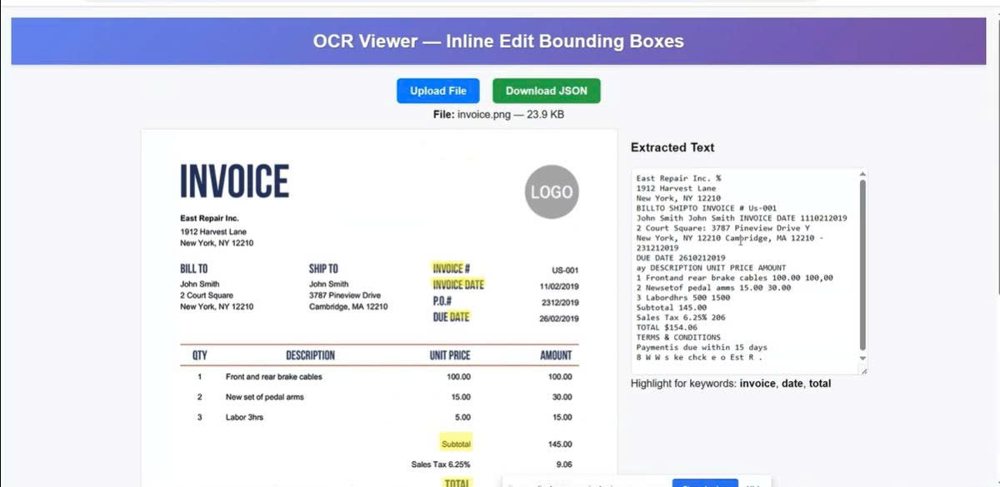

# OCR Extractor Mini

Project Backend đơn giản để extract văn bản và bounding boxes từ ảnh/PDF bằng Tesseract.js, cùng các tiện ích xử lý file tạm và chuyển PDF -> ảnh.

## Cài đặt và chạy
Tải source code về máy:
```sh
  git clone https://github.com/VoHuan/ocr-extractor-mini.git
```

# Run Frontend
1. cd vào thư mục frontend
```sh
cd OCR-EXTRACTOR-MINI-FE\ocr-extractor-mini-fe
```
2. Cài dependencies
```sh
npm install
```
3. Chạy ở chế độ phát triển
```sh
npm run dev
```
4. Mở trình duyệt truy cập vào địa chỉ http://localhost:5173

# Run Backend
1. cd vào thư mục backend
```sh
cd OCR-EXTRACTOR-MINI-BE
```
2. Cài dependencies
```sh
npm install
```

3. Chạy ở chế độ phát triển (sử dụng nodemon)
```sh
npm run dev
```


### Important: Đảm bảo đã cài đặt [poppler-utils](https://github.com/oschwartz10612/poppler-windows/releases/) trên hệ thống windows để pdf-poppler hoạt động.

- Windows : Tải poppler cho Windows và thêm vào PATH.
- MacOS : `brew install poppler`
- Linux : `sudo apt-get install poppler-utils`

## Cách hoạt động (tóm tắt)
- FE gửi file (ảnh/PDF) lên BE qua API `/upload`.
- BE lưu file tạm, nếu là PDF thì convert từng trang thành ảnh PNG/JPG.
- BE chạy OCR trên ảnh (hoặc từng trang ảnh của PDF) bằng Tesseract.js.
- BE trả về kết quả OCR (text, bounding boxes) cho FE.
- FE dùng kết quả để highlight từ khóa trong ảnh/PDF.

## Data mẫu để test:
- FILE Ảnh mẫu: [Docs/Image-test/invoice.png](Docs/Image-test/invoice.png)
- FILE Json mẫu kết quả OCR: [Docs/invoice.png.json](Docs/invoice.png.json)

## 📽️ Demo OCR Extractor
# Click vào image để xem video demo
[](https://drive.google.com/file/d/1tFCkf7PQbe_kV_4H8JDb97wrmmXUZyjx/preview)
